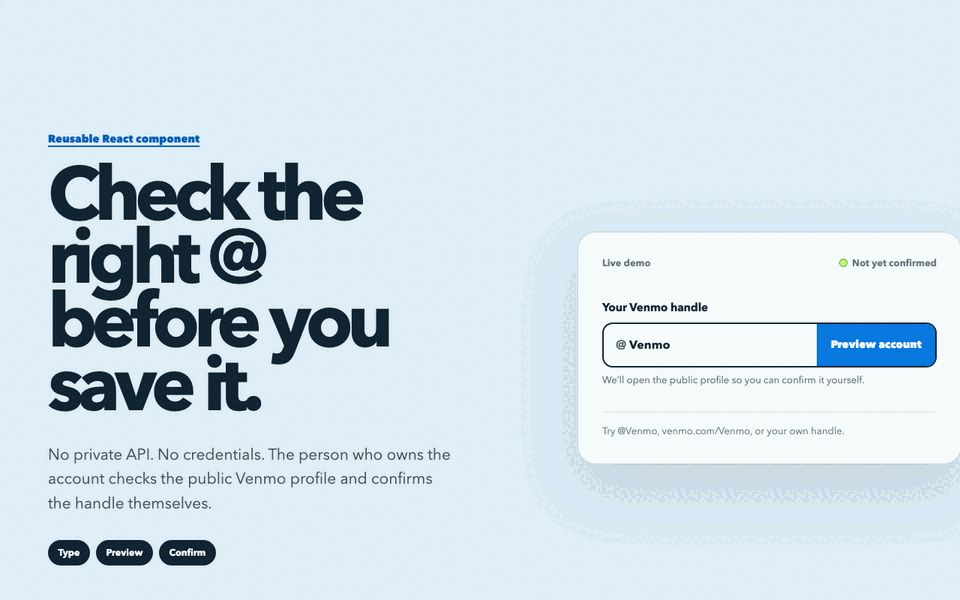
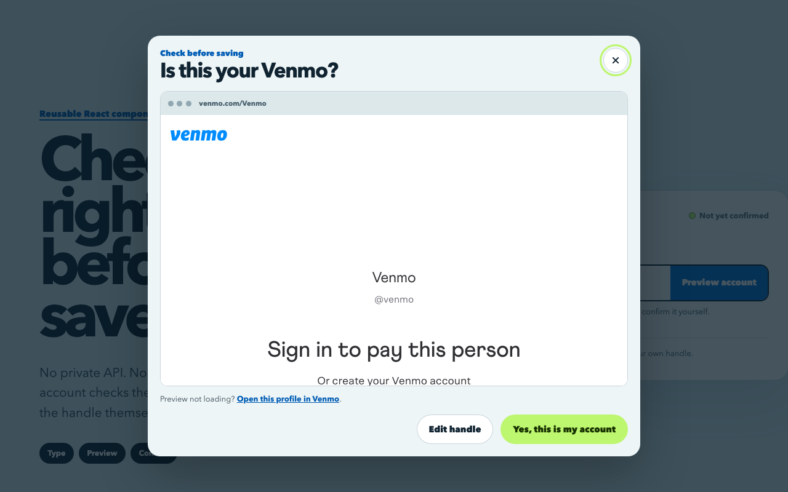
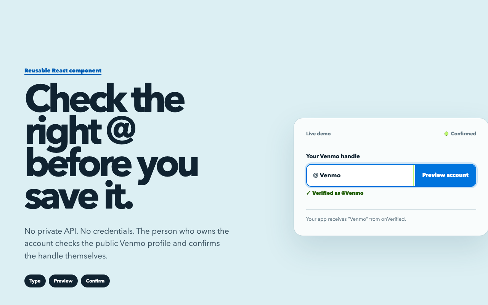
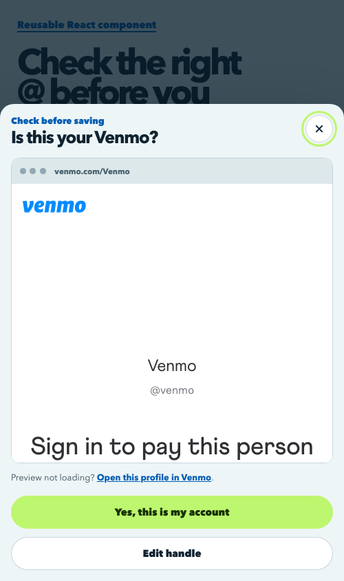

# Venmo handle verification

A small React component that helps people confirm their own Venmo handle before your app saves it. It normalizes a typed handle or pasted Venmo profile URL, opens the public profile inside a modal, and returns the handle only after explicit confirmation.

It does **not** use an unofficial API, claim that a handle exists, or ask for Venmo credentials.



## Demo flow

Type a handle or paste a Venmo profile URL, preview the public profile without leaving the form, then confirm that it is the right account.

| Account preview | Confirmed handle |
| --- | --- |
|  |  |

<details>
<summary>Mobile preview</summary>



</details>

## Install

```bash
npm install
npm run dev
```

Open `http://localhost:5173` to use the complete demo site. The demo starts with Venmo’s public `@Venmo` profile so the modal can be tried immediately.

## Use

Copy `src/VenmoVerification.tsx` and `src/venmo-verification.css` into a React app, or install this repository directly:

```bash
npm install github:rsgenack/venmo-handle-verification
```

```tsx
import { VenmoVerification } from "venmo-handle-verification";
import "venmo-handle-verification/style.css";

export function PaymentDetails() {
  return (
    <VenmoVerification
      onVerified={(handle) => {
        // Save only after the user confirms the profile.
        console.log(handle);
      }}
    />
  );
}
```

Accepted input includes `@yourname`, `yourname`, `venmo.com/yourname`, and `account.venmo.com/u/yourname`. Changing the input clears the verified state.

### Props

| Prop | Type | Purpose |
| --- | --- | --- |
| `onVerified` | `(handle: string) => void` | Receives the normalized handle after confirmation. |
| `onValueChange` | `(value: string) => void` | Receives input edits and normalization. |
| `defaultValue` | `string` | Sets the initial value. |
| `inputName` | `string` | Sets the form field name. Defaults to `venmoHandle`. |
| `label` | `string` | Overrides the input label. |
| `disabled` | `boolean` | Disables editing and preview. |

## Verify

```bash
npm test
npm run build
npm run build:demo
```

To refresh the README screenshots and GIF after a visual change:

```bash
npm run docs:capture
```

The capture script needs Chrome or Chromium. It uses ImageMagick when available to rebuild the animated GIF; the PNG screenshots are always generated.

Venmo can change its profile pages or framing policy at any time, so the modal includes an **Open this profile in Venmo** fallback. This component is not affiliated with or endorsed by Venmo or PayPal.
